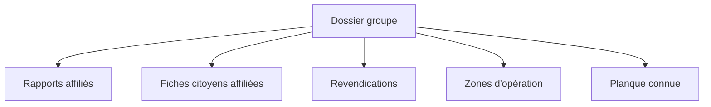
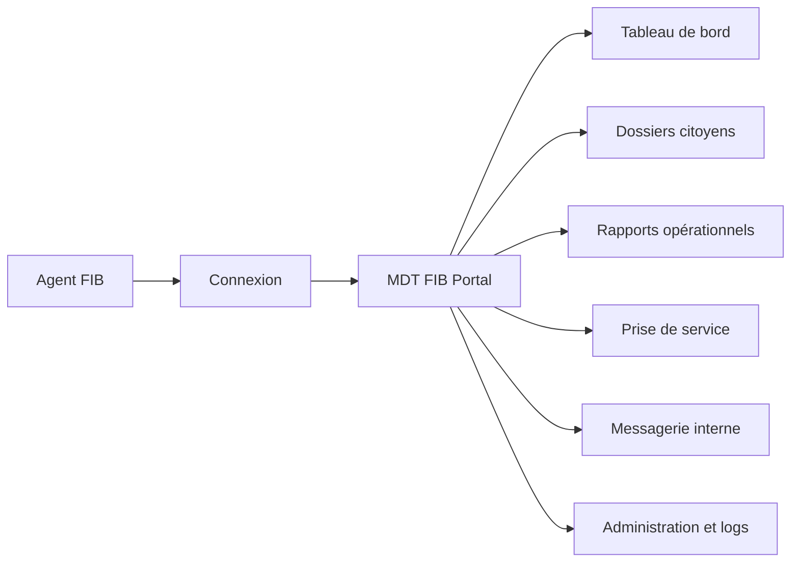

<div align="center">


# FIB Portal

### MDT de communication et de gestion opérationnelle pour GTA V RP


**Une interface web interne pour les agents du FIB sur un serveur GTA V roleplay.**

[Installation](#installation-locale) · [Fonctionnalités](#fonctionnalités) · [Dossiers groupes](#dossiers-groupes) · [Structure](#organisation-du-projet)

</div>

<br>

> FIB Portal centralise les informations, les rapports, la prise de service et la communication entre agents dans un seul MDT accessible depuis un navigateur.

<table align="center">
<tr>
<td>🛰️ <strong>Interface MDT</strong><br>Outil web du FIB</td>
<td>🔐 <strong>Accès sécurisé</strong><br>Sessions agents</td>
<td>📡 <strong>Communication</strong><br>Messagerie interne</td>
</tr>
</table>

FIB Portal est une interface web de communication et de gestion opérationnelle, conçue comme un **MDT (Mobile Data Terminal)** pour un serveur de jeu **GTA V en roleplay (RP)**.

L'objectif est de fournir aux agents du FIB une interface centralisée pour consulter les informations utiles à leurs interventions, rédiger des rapports, suivre leur prise de service et communiquer avec les autres membres de l'organisation. Le site fonctionne dans un navigateur et peut être utilisé comme outil complémentaire pendant les sessions RP.

## 🎯 Rôle du MDT en RP

Dans le cadre du roleplay, le MDT représente le système informatique interne du FIB. Il permet notamment de :

- centraliser les informations sur les citoyens rencontrés en jeu ;
- documenter les interventions et les événements dans des rapports ;
- identifier l'agent responsable d'un rapport ;
- communiquer de manière privée entre agents grâce à la messagerie interne ;
- indiquer si un agent est en service, en pause ou hors service ;
- donner aux responsables une vue sur les agents, les activités et les logs système.

Le projet fournit l'interface et la base de données du MDT. Il ne se connecte pas directement au client GTA V et ne remplace pas les scripts ou ressources du serveur de jeu.

## 🗺️ Vue d'ensemble

| Module | Utilité dans le RP | Accès |
| --- | --- | --- |
| 📊 Tableau de bord | Suivre l'activité globale du FIB | `/auth/dashboard` |
| 👤 Citoyens | Créer et consulter les fiches citoyen | `/citizens` |
| 📄 Rapports | Documenter les interventions et preuves | `/reports` |
| 📁 Dossiers groupes | Regrouper groupes, rapports et citoyens | `/groups` |
| ⏱️ Service | Gérer la prise de service et les pauses | `/service` |
| ✉️ Messages | Communiquer entre agents | `/messages` |
| 🛡️ Administration | Gérer les accès et consulter les logs | `/users/admin`, `/logs/admin` |

## ✨ Fonctionnalités

### 🔐 Authentification

- Connexion des agents avec identifiant et mot de passe.
- Inscription avec grade et niveau d'accréditation.
- Protection des pages internes par session.
- Déconnexion de la session active.

### 📊 Tableau de bord

Le tableau de bord présente une vue synthétique de l'activité du FIB :

- nombre d'agents actuellement en service ;
- nombre total de rapports ;
- nombre de citoyens enregistrés ;
- durée totale de service ;
- classement des heures de service ;
- activité récente concernant les rapports et les citoyens.

### 👤 Dossiers citoyens

Les agents peuvent créer une fiche citoyen avec son identité, sa date de naissance et ses informations opérationnelles : téléphone, profession, affiliation, permis, véhicules, habitations et armes enregistrées.

Chaque fiche peut également contenir plusieurs photos ou images, consultables dans une galerie depuis le dossier citoyen. Les statuts **Recherché** et **Dangereux** sont activables indépendamment.

### 📄 Rapports opérationnels

Les rapports peuvent contenir :

- un titre et une description détaillée ;
- un niveau de confidentialité ;
- les personnes et agents concernés ;
- les véhicules et plaques d'immatriculation ;
- les armes et numéros de série.

Un rapport peut être consulté, modifié ou supprimé. L'agent ayant créé le rapport est conservé dans la base de données.

### ✉️ Messagerie interne

La messagerie fonctionne comme une boîte mail réservée aux agents :

- boîte de réception ;
- messages envoyés ;
- sélection d'un destinataire parmi les utilisateurs enregistrés ;
- objet et contenu du message ;
- suppression des messages reçus ou envoyés par leur propriétaire.

### ⏱️ Prise de service

Un agent peut démarrer son service, le mettre en pause, le reprendre et le terminer. Les durées sont enregistrées dans MySQL et utilisées dans le classement affiché sur le tableau de bord.

### 🛡️ Administration et logs

Les agents disposant d'une accréditation suffisante peuvent gérer les grades et les niveaux d'accès des utilisateurs. Les connexions, inscriptions, modifications et créations de rapports sont enregistrées dans les logs du système.

## 📁 Dossiers groupes

Un dossier groupe permet de centraliser le renseignement sur une organisation ou un groupe actif dans le RP. Il peut contenir :

- 🏷️ un nom de groupe ;
- 📣 ses revendications ;
- 🗺️ ses zones d'opération régulières ;
- 🏚️ sa planque connue ;
- 📄 les rapports qui lui sont affiliés ;
- 👤 les fiches citoyens qui lui sont rattachées.

### Créer un dossier

Depuis la page `/reports`, choisissez le type **Dossier groupe** dans la fiche de création. Seul le nom est obligatoire ; les revendications, zones et planque peuvent être complétées plus tard.

Pour rattacher un rapport existant, sélectionnez un dossier groupe dans le formulaire. Pour rattacher un citoyen, choisissez le groupe depuis la création ou la modification de sa fiche.



## Fonctionnement



Le MDT est un outil complémentaire au serveur GTA V : les agents effectuent leurs actions RP dans le jeu et utilisent FIB Portal pour consigner, consulter et partager les informations de leur organisation.

## Technologies utilisées

- **Node.js** : environnement d'exécution JavaScript côté serveur.
- **Express** : serveur HTTP et organisation des routes.
- **EJS** : génération des pages HTML côté serveur.
- **MySQL** : stockage des utilisateurs, citoyens, rapports, messages, services et logs.
- **mysql2** : connexion entre Node.js et MySQL.
- **bcrypt** : hachage et vérification des mots de passe.
- **express-session** : gestion des sessions authentifiées.
- **Axios** : appels HTTP utilisés par les fonctionnalités externes du projet.

## Prérequis

- Node.js 18 ou version plus récente ;
- npm ;
- MySQL 8 ou une version compatible ;
- Git pour cloner le dépôt.

## Installation locale

### Démarrage rapide

```bash
git clone https://github.com/Shoccapik/fib.git
cd fib
npm install
mysql -u root -p < database/schema.sql
npm start
```

Puis ouvrez [http://localhost:3000](http://localhost:3000).

### 1. Récupérer le projet

```bash
git clone https://github.com/Shoccapik/fib.git
cd fib
```

### 2. Installer les dépendances

```bash
npm install
```

Cette commande installe toutes les dépendances définies dans `package.json`. Le dossier `node_modules` est volontairement exclu du dépôt par `.gitignore`.

### 3. Préparer MySQL

Créez la base et les tables avec le script fourni :

```bash
mysql -u root -p < database/schema.sql
```

Le script crée la base `fib_portal`, les tables nécessaires et un compte administrateur initial.

La connexion Plesk est définie directement dans `config/database.js` :

```js
host: "localhost",
port: 3306,
user: "admin12",
password: "...",
database: "fib_portal"
```

Au démarrage, l'application vérifie également les colonnes ajoutées aux citoyens et aux rapports afin de mettre à niveau la base existante.

### 4. Démarrer le MDT

```bash
npm start
```

Le serveur démarre sur :

```text
http://localhost:3000
```

Ouvrez cette adresse dans un navigateur pour accéder à l'écran de connexion.

## Compte initial

Le script SQL fournit le compte de démonstration suivant :

- Utilisateur : `admin`
- Mot de passe : `admin123`

Changez ce mot de passe et utilisez des identifiants adaptés avant tout déploiement sur un serveur RP public.

## Organisation du projet

```text
fib/
├── config/              # Connexion MySQL
├── database/            # Schéma SQL
├── middleware/          # Protection des routes
├── public/              # CSS, JavaScript et images
├── routes/              # Routes Express par fonctionnalité
├── utils/               # Outils communs, notamment les logs
├── views/               # Pages EJS du MDT
├── .gitignore           # Fichiers exclus du dépôt Git
├── package.json         # Dépendances et scripts npm
└── server.js            # Point d'entrée de l'application
```

## Routes principales

- `/` : connexion ;
- `/auth/register` : inscription ;
- `/auth/dashboard` : tableau de bord ;
- `/citizens` : dossiers citoyens ;
- `/reports` : rapports opérationnels ;
- `/groups` : dossiers groupes et informations de renseignement ;
- `/service` : prise de service ;
- `/messages` : messagerie interne ;
- `/users/admin` : administration des utilisateurs ;
- `/logs/admin` : logs du système.

## Vérification

Le projet ne contient pas encore de suite de tests automatisée. Les commandes suivantes vérifient la syntaxe du serveur, des routes et de la vue Messages :

```bash
node --check server.js
node --check routes/messages.js
```

Pour tester complètement l'application, MySQL doit être démarré et la base `fib_portal` doit être accessible avec les paramètres définis dans `config/database.js`.

## Avertissement RP

Ce projet est destiné à un usage de roleplay sur GTA V. Les données affichées sont des données de jeu et ne doivent pas être utilisées comme un véritable système policier ou administratif.
